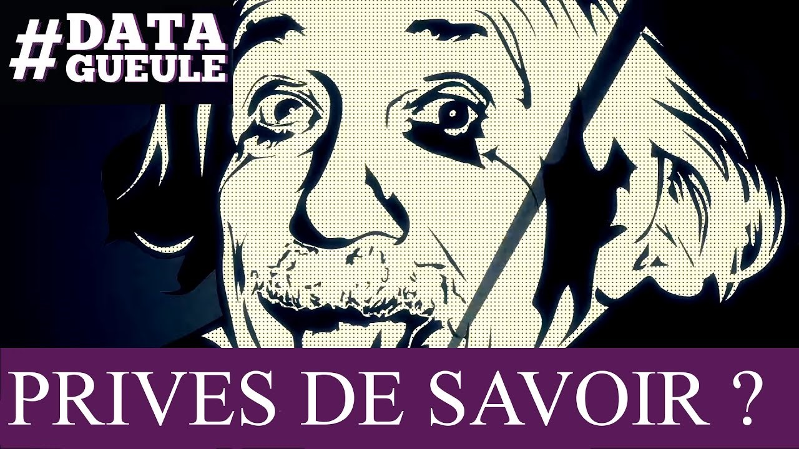
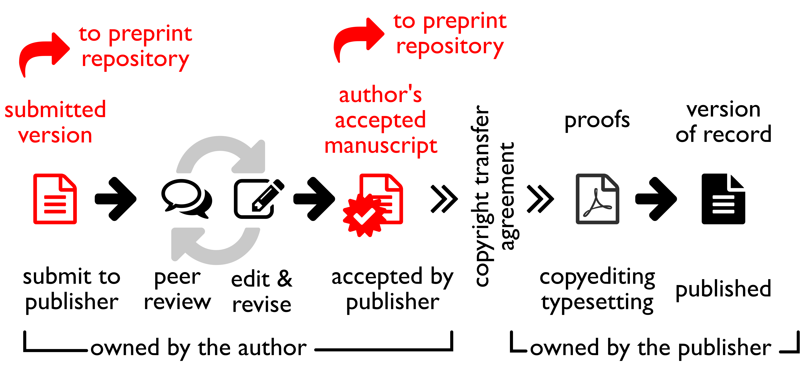
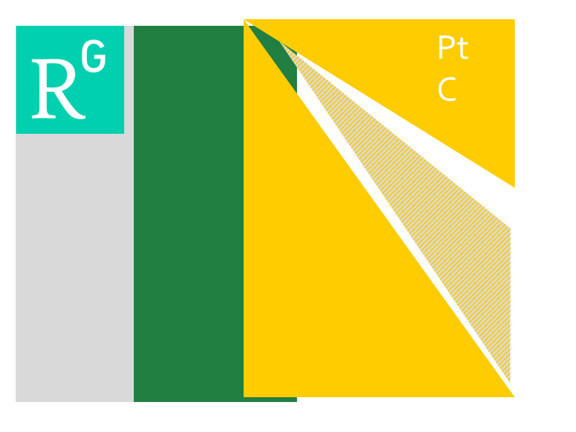
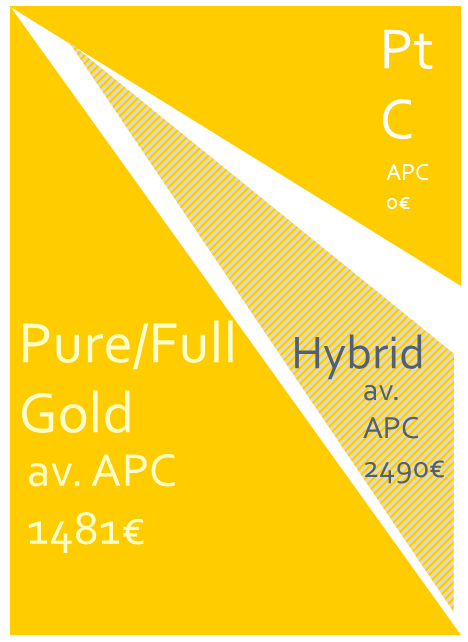
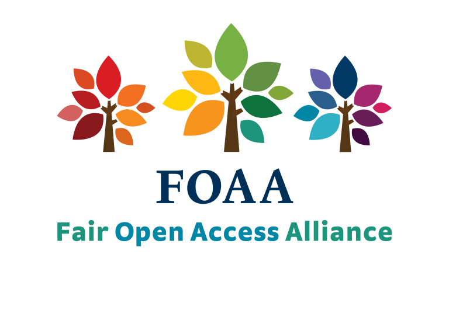
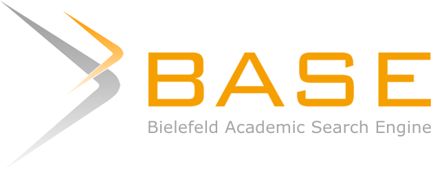

<!-- $theme: default-->
<!-- $size: 16:9 -->

# Open access and beyond : means, opportunities and challenges

## ED481 - École doctorale des Sciences Sociales et Humanités de l’université de Pau et des Pays de l’Adour

30th January 2019

Training material available [here](https://github.com/fflamerie/pau_ed_2019)

<small>

*Frédérique Flamerie*
*open access and data librarian*
*University of Bordeaux - Documentation department*
</small>

---

# Agenda

## Movies and TV Game

 

## Discussions : :question:Q01 :question:Q02

---

# Agenda
## DataGueule « Privés de savoir? » and addenda
## Open access avatars
## Specificities for humanities and social sciences
## What opportunities for you ?
## The big picture

---

#  DataGueule « Privés de savoir? »

Available at : https://www.youtube.com/watch?v=WnxqoP-c0ZE

---

# "Privés de savoir? " - _addendum 1_ : French Law
The Law for a Digital Republic promulgated on 8 October 2016 includes an article dedicated to open access to scientific articles, article 30.

 

<!-- *footer : Image from : Magron, A. (2016). ‘Vos dépôts dans HAL : ce qui change avec la loi pour une République Numérique’. CCSD. Retrieved from https://www.ccsd.cnrs.fr/2016/10/vos-depots-dans-hal-ce-qui-change-avec-la-loi-pour-une-republique-numerique/
-->

---

# "Privés de savoir? " - _addendum 1_ : French Law

In short, all scientific **articles** resulting from public research can now be deposited into an open access repository :
* in a manuscript format : **author accepted  manuscript** (AAM),
* with a maximum **embargo** of 6 months (science and medicine)/12 months (humanities and social sciences),

regardless of the publisher's open access policy.

## Do you want to know more?

* [Read article 30 of the law on Legifrance](https://www.legifrance.gouv.fr/eli/loi/2016/10/7/ECFI1524250L/jo#JORFARTI000033202841)

* Questions? See the [detailed FAQ in French provided by Couperin](https://openaccess.couperin.org/category/faq/)

---

# "Privés de savoir? " - _addendum 2_ : versions of an article

Version of Record (VoR) : https://doi.org/10.25428/1824-2979/201802-231-2482 / AAM : http://hal.archives-ouvertes.fr/hal-01736525 :warning: same journal but different articles
 

---

# "Privés de savoir? " - _addendum 2_ : versions of an article

Definition of AAM :

> Paper as accepted for publication, including all changes resulting from peer review, but not necessarily incorporating the publisher’s formatting or layout.

From : Oxford University. ‘Glossary’. open access oxford. Retrieved from http://openaccess.ox.ac.uk/glossary/

<mark>It is different from the proofs.</mark>

:arrow_right: How to get this version of your article from publishers' submission systems?

Open Access Button. (2018). ‘Direct2AAM: Helping Authors Find Author Accepted Manuscripts’. Open Access Button. Retrieved from https://openaccessbutton.org/direct2aam

---

# "Privés de savoir? " - _addendum 2_ : versions of an article

<small>

<!-- *footer : Image from : Marwick, B. (2017). ‘Open Science in Archaeology’. Open Science Framework. https://doi.org/10.17605/OSF.IO/3D6XX
-->

</small>

---

#  "Privés de savoir? " - _addendum 3_ : who needs access to scientific publications?

## :question:Q03

Tennant, J. P. et al. (2016). ‘The academic, economic and societal impacts of Open Access: an evidence-based review’. F1000Research, 5, 632. https://doi.org/10.12688/f1000research.8460.3

A dedicated website : http://whoneedsaccess.org

> This site is run collaboratively by the [@access working group](http://access.okfn.org/) — a loose coalition of academics in various fields — plus you.  We want to know your stories about how access to scientific literature has enabled you to do more, create more, and give more back to the world.  If that’s you, please see the [Contribute](https://whoneedsaccess.org/contribute/) page.

---

#  "Privés de savoir? " - _addendum 3_ : what does access means?

>  By "open access" to this literature, we mean its free availability on the public internet, permitting any users to read, download, copy, distribute, print, search, or link to the full texts of these articles, crawl them for indexing, pass them as data to software, or use them for any other lawful purpose, without financial, legal, or technical barriers other than those inseparable from gaining access to the internet itself. The only constraint on reproduction and distribution, and the only role for copyright in this domain, should be to give authors control over the integrity of their work and the right to be properly acknowledged and cited.

Chan, L. et al. (2002). ‘Read the Budapest Open Access Initiative’. Budapest Open Access Initiative. Retrieved from https://www.budapestopenaccessinitiative.org/read

---

# Open access avatars 

---
# Open access avatars : is this open access 1/3? :question:Q04

:heavy_minus_sign::heavy_minus_sign::heavy_minus_sign::heavy_minus_sign::heavy_minus_sign::heavy_minus_sign::heavy_minus_sign::heavy_minus_sign::heavy_minus_sign::heavy_minus_sign::heavy_minus_sign::heavy_minus_sign::heavy_minus_sign::heavy_minus_sign::heavy_minus_sign::heavy_minus_sign::heavy_minus_sign::heavy_minus_sign::heavy_minus_sign::heavy_minus_sign:

---
# Open access avatars : is this open access 2/3? :question:Q05

---
# Open access avatars : is this open access 3/3?

---
# Open access avatars

---
# Open access avatars

---

# The green and the grey

We will go into more details regarding these services later on, for the moment let's just check the following chart.

  

<!-- *footer : From : Fortney, K. & Gonder, J. (2015). ‘A social networking site is not an open access repository’. Office of Scholarly Communication - University of California. Retrieved from http://osc.universityofcalifornia.edu/2015/12/a-social-networking-site-is-not-an-open-access-repository/-->

---

# The gold and the grey
 
## :question:Q06

---

# The gold and the grey : economic typology

---

# The gold and the grey : economic typology

Data from [Open APC](https://www.intact-project.org/openapc/) : 2005-2018, 158 research institutions 
| Value in €| Full OA | Hybrid OA |
| :--:| --:| --:|
|average |1481  | 2490 |
|median | 1407 | 2443 |

 

>There is hence concern that hybrid APCs often reflect traditional publishers’ concern to maintain existing profit margins and market position rather than the true costs of publishing.

Ross-Hellauer, T. et al. (2018). ‘Are funder Open Access platforms a good idea?’ PeerJ Preprints, 6, e26954v1. https://doi.org/10.7287/peerj.preprints.26954v1

---

# The gold and the grey : specificity for humanities and social sciences 

The hybrid model (the grey) is more proeminent in exact sciences, technology and medicine ; if you want to know more about this model, please check the ED211 session's slides.
:warning: Data from Web of Science - mind the gap! (see next slide)

<!-- *footer : Image from : 101 Innovations. (2018). ‘Towards a Plan S gap analysis? (1) Open access potential across disciplines’. Innovations in Scholarly Communication. Retrieved from https://101innovations.wordpress.com/2018/12/05/oa-potential-journals-and-publications-across-disciplines/ -->

---

# Counting open access journals : mind the gap!

Social Sciences : **21,2%**  of open access journals indexed in Directory of Open Access Journals (DOAJ, see below) are included in Web of Science

Arts & Humanities : **19,5%**

From : 101 Innovations. (2018). ‘Towards a Plan S gap analysis? (2) Gold open access journals in WoS and DOAJ’. Innovations in Scholarly Communication. Retrieved from https://101innovations.wordpress.com/2018/12/05/gold-oa-journals-in-wos-and-doaj/

---

# The gold and the grey : specificity for arts and humanities 

:warning: Data from Web of Science

<!-- *footer : Image from : 101 Innovations. (2018). ‘Towards a Plan S gap analysis? (1) Open access potential across disciplines’. Innovations in Scholarly Communication. Retrieved from https://101innovations.wordpress.com/2018/12/05/oa-potential-journals-and-publications-across-disciplines/
 -->

---

# The gold and the grey : specificity for social sciences

:warning: Data from Web of Science

<!-- *footer : Image from : 101 Innovations. (2018). ‘Towards a Plan S gap analysis? (1) Open access potential across disciplines’. Innovations in Scholarly Communication. Retrieved from https://101innovations.wordpress.com/2018/12/05/oa-potential-journals-and-publications-across-disciplines/
 -->

---

# The gold : specificity for humanities and social sciences

In contrast with journals in exact sciences, technology and medicine, most open acess journals in social sciences and humanities do not charge fees (_article processing charges_).
The economic model of those journals may be based on one or more of the following elements.
* **Sponsor** funding : publications costs are covered through donations, grants, institutional subsidies, etc.
* **Embargo** period : articles are automatically made open access after a defined period of time - see [journals with Embargo period policy published by OpenEdition](https://www.openedition.org/catalogue-journals?limit=30&access%5B%5D=Barri%C3%A8re+mobile)
* **Freemium** : extra services are charged to (partially) cover publication costs - see [journals with Open access Freemium published by OpenEdition](https://www.openedition.org/catalogue-journals?limit=30&access%5B%5D=Open+access+Freemium)

---

# The gold : how to find your way around?

## [Think, check, submit](https://thinkchecksubmit.org/) 
Helps you identify trusted journals, using among others DOAJ
## [DOAJ](https://doaj.org/) 
The Directory of Open Access Journals is an independant, community-curated online directory that indexes and provides access to high quality, open access, peer-reviewed journals. 
## [QUOAM](https://www.qoam.eu/)
Quality Open Access Market is developed ad maintained by researchers from Radboud University Nijmegen, QUOAM is a market place, including **quality scoring** based on academic crowd sourcing and **price information** with institutional licensed pricing.

---

# Towards non-profit scholarly communication ?

Adema, J. & Stone, G. (2017). ‘Taking back control: the new university and academic presses that are re-envisioning scholarly publishing’. LSE Impact Blog. Retrieved from http://blogs.lse.ac.uk/impactofsocialsciences/2017/09/20/taking-back-control-the-new-university-and-academic-presses-that-are-re-envisioning-scholarly-publishing/

Pooley, J. (2017). ‘Scholarly communications shouldn’t just be open, but non-profit too’. LSE Impact Blog. Retrieved from http://blogs.lse.ac.uk/impactofsocialsciences/2017/08/15/scholarly-communications-shouldnt-just-be-open-but-non-profit-too/

---

# Specificity for humanities and social sciences : what about books? economics

## [OpenEdition Books](https://books.openedition.org)

OpenEdition publishes not only journals but also books. 

Open Edition Freemium programme includes books - univ. Pau is one of the subscribing institutions. 

## [Knowledge Unlatched](http://www.knowledgeunlatched.org/)
Crowdfunding programme to "unlatch", make open access, journals and monographs.

---

# Specificity for humanities and social sciences : what about books? editorial concerns

 

[DOAB](https://www.doabooks.org/) indexes academic books provided they are :
* available under an **Open Access license** (such as a Creative Commons license),
* subjected to independent and external **peer review** prior to publication.

More about books : Mounier, P. (2019). ‘Open Scholarly monographs, from technology to usage’. Presented at the FOSTER - DARIAH workshop Open Access in the Humanities, Berlin. Retrieved from https://fr.slideshare.net/piotrr/open-scholarly-monographs-from-technology-to-usage

---

# What opportunities for you?

<!-- *footer: Image by GotCredit - CC-BY - Retrieved from :  https://www.flickr.com/photos/gotcredit/32943765623/-->

---

# You are using publications : broaden your scope

In terms of disciplinary coverage
In terms of types of document retrievable

## :question: Q07
## :question: Q08

---

# You are using publications : tools to find journal articles : Google Scholar

Search interface 
:heavy_plus_sign: Browser extension 
:heavy_plus_sign: Source for the browser extension [Lazy Scholar](http://www.lazyscholar.org/)

More about Google Scholar invention here : Levy, S. (2014). ‘The Gentleman Who Made Scholar’. Backchannel. Retrieved from https://medium.com/backchannel/the-gentleman-who-made-scholar-d71289d9a82d -

--- 

# You are using publications : tools to find journal articles : other tools

 ## [Unpaywall](https://unpaywall.org/)  
Browser extension 
:heavy_plus_sign: integrated into Zotero, Scopus, Web of Science, etc.

## [Open Access Button](https://openaccessbutton.org/)  
Browser extension : search and request, articles 
:heavy_plus_sign: might be integrated into library services

## More about Unpaywall and Open Access Button 
See the page [https://openaccessbutton.org/skip_the_paywall](https://openaccessbutton.org/skip_the_paywall)

---

# You are using publications : tools to find other open access materials 1/2

 
[BASE](https://www.base-search.net/) - Bielefeld Academic Search Engine
* Non commercial
* Defined sources
* Advanced search : including/excluding document types
* Sorting and filtering results

---

# You are using publications : tools to find other open access materials 2/2

 
[Isidore](https://isidore.science/) - "Votre assistant de recherche en Sciences Humaines et Sociales"
* Non commercial : part of Huma-Num
* Disciplinary specialization
* Defined sources
* Metadata enhancements 
* Advanced search, etc.
:heavy_plus_sign: integrated into Zotero

---

# You are producing publications : publishing preprints?

A definition :

> In short, a preprint is a research output that has not completed a typical publication pipeline but is of value to the community and deserving of being easily discovered and accessed.

and a how-to :
Bourne, P. E. et al. (2017). ‘Ten simple rules to consider regarding preprint submission’. PLOS Computational Biology, 13(5), e1005473. https://doi.org/10.1371/journal.pcbi.1005473

---

# You are producing publications : publishing preprints?

Does this way of publishing apply to humanities and social sciences (beyond economy that has long adopted it)? 

> In the short run, SocArXiv will be a convenient, fast, free, open paper server. In the longer run, we hope it will be a building block for the future system of scholarly communication. In sociology, the discipline with which I (and our steering committee) are most familiar, we do not have a strong cultural norm of pre-print paper sharing, or data sharing. But sociologists – like most social scientists – do want our research to have an impact in the wider world, to reach a broader audience, and to engage with the public for the benefit of all parties. Our challenge is to persuade these academic communities that open scholarship is necessary for achieving that larger ambition.

Cohen, P. (2016). ‘Developing SocArXiv — a new open archive of the social sciences to challenge the outdated journal system.’ LSE Impact Blog. Retrieved from http://blogs.lse.ac.uk/impactofsocialsciences/2016/07/11/developing-socarxiv-an-open-archive-of-the-social-sciences/

---

# You are producing publications : publishing preprints?

## A story

Marwick, B. (2019). ‘We put a pre-print on @socarxiv 10 days ago. Yesterday I got a request from a journal to peer review a paper. Our pre-print is cited in the paper I’m reviewing. Pre-prints are a truly impressive accelerator of research communication. cf. https://doi.org/10.1073/pnas.1511912112 … #academictwitterpic.twitter.com/NvPYvSHrXN’ [Tweet]. @benmarwick. Retrieved from https://twitter.com/benmarwick/status/1085226457217982465

## Do you know other preprint platforms than SocArXiv?
[PhilArchive](https://philarchive.org/)? 
[PsyArXiv](https://psyarxiv.com/)?

---

# You are producing research : "open access made concrete"

>* You can show how your research **evolves over time** (with everything being online, you are held accountable if you change your  mind, say things differently, etc.)
>* You can **address different communities** depending on what part of your research you decide to make available
>* You have tools to speak about your data/corpora in further publications

First level items, see slides 8 and 9 for details

Naomi, T. (2019). ‘How to make the most of  your publications in the  humanities?’ Presented at the FOSTER - DARIAH workshop Open Access in the Humanities, Berlin. Retrieved from https://f.hypotheses.org/wp-content/blogs.dir/3903/files/2019/01/Open-Access-Berlin-Naomi-Truan-21.01.2019.pdf

---

# You are producing publications : enhancing your visibility as a researcher 

ORCID + other tools (after the break)

* Building your reputation
  * be visible **as a researcher**
  * be identified in a unique and unambiguous way
* Giving full text access to **ALL** your productions and outputs (articles, data, thesis, etc.)

---

# The big picture

---

# Open access is one facet of open science

<!-- *footer : Image from : Fuente, G. B. de la. Open Science facets as a beehive. Retrieved from https://www.fosteropenscience.eu/content/what-open-science-introduction - CC-BY-->

---

# Stakeholders' policies

Are you aware of funders' expectations and requirements ?

* European Commission

Dechamp, J.-F. (2018). ‘Research and Innovation in transformation: the transition to Open Science’. Presented at the NARMA2018, Lillestrom. Retrieved from https://www.slideshare.net/OpenAccessEC/research-and-innovation-in-transformation-the-transition-to-open-science

* cOAlition S - including ANR

Science Europe. (2018). ‘Plan S : Making full and immediate Open Access a reality’. Retrieved from https://www.scienceeurope.org/coalition-s/

---
# Thank you for your attention!

## Des :interrobang:
## Des :bulb:

 

:email: frederique.flamerie-de-lachapelle@u-bordeaux.fr
:telephone_receiver: 05.40.00.89.91

 

 [orcid.org/0000-0001-6014-0134](https://orcid.org/0000-0001-6014-0134)

