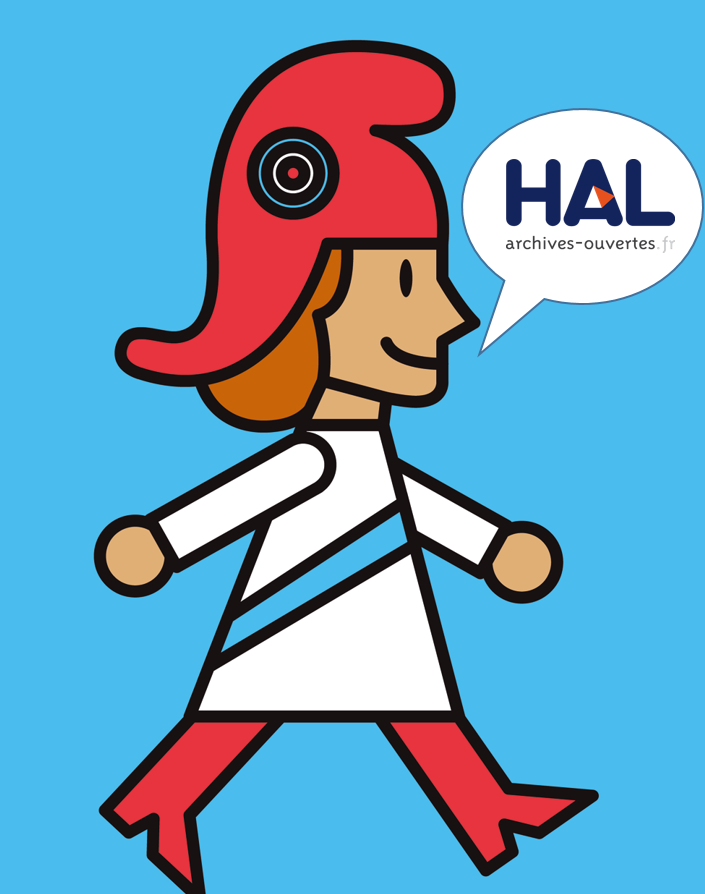
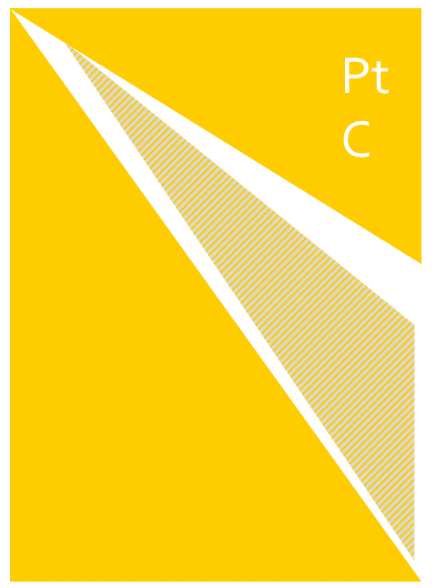

<!-- $theme: default-->
<!-- $size: 16:9 -->

# Open access and beyond : means, opportunities and challenges

## ED211 - École doctorale des Sciences Exactes et leurs applications de l’université de Pau et des Pays de l’Adour

31st January 2019

Training material available [here](https://github.com/fflamerie/pau_ed_2019)

<small>

*Frédérique Flamerie*
*open access and data librarian*
*University of Bordeaux - Documentation department*
</small>

---

# Agenda

## Movies and TV Game

 

## Discussions : :question:Q01 :question:Q02

---

# Agenda
## DataGueule « Privés de savoir? » and addenda
## Open access avatars
## Focus on open access journals
## What opportunities for you ?
## The big picture

---

#  DataGueule « Privés de savoir? »

Available at : https://www.youtube.com/watch?v=WnxqoP-c0ZE

---

# "Privés de savoir? " - _addendum 1_ : French Law
The Law for a Digital Republic promulgated on 8 October 2016 includes an article dedicated to open access to scientific articles, article 30.

 

<!-- *footer : Image from : Magron, A. (2016). ‘Vos dépôts dans HAL : ce qui change avec la loi pour une République Numérique’. CCSD. Retrieved from https://www.ccsd.cnrs.fr/2016/10/vos-depots-dans-hal-ce-qui-change-avec-la-loi-pour-une-republique-numerique/
-->

---

# "Privés de savoir? " - _addendum 1_ : French Law

In short, all scientific **articles** resulting from public research can now be deposited into an open access repository :
* in a manuscript format : **author accepted  manuscript** (AAM),
* with a maximum **embargo** of 6 months (science and medicine)/12 months (humanities and social sciences),

regardless of the publisher's open access policy.

## Do you want to know more?

* [Read article 30 of the law on Legifrance](https://www.legifrance.gouv.fr/eli/loi/2016/10/7/ECFI1524250L/jo#JORFARTI000033202841)

* Questions? See the [detailed FAQ in French provided by Couperin](https://openaccess.couperin.org/category/faq/)

---

# "Privés de savoir? " - _addendum 2_ : versions of an article

Version of Record (VoR) : https://doi.org/10.1016/j.epsl.2016.09.032 / AAM : http://hal.archives-ouvertes.fr/hal-01386646
 

---

# "Privés de savoir? " - _addendum 2_ : versions of an article

Definition of AAM :

> Paper as accepted for publication, including all changes resulting from peer review, but not necessarily incorporating the publisher’s formatting or layout.

From : Oxford University. ‘Glossary’. open access oxford. Retrieved from http://openaccess.ox.ac.uk/glossary/

<mark>It is different from the proofs.</mark>

:arrow_right: How to get this version of your article from publishers' submission systems?

Open Access Button. (2018). ‘Direct2AAM: Helping Authors Find Author Accepted Manuscripts’. Open Access Button. Retrieved from https://openaccessbutton.org/direct2aam

---

# "Privés de savoir? " - _addendum 2_ : versions of an article

<small>

<!-- *footer : Image from : Marwick, B. (2017). ‘Open Science in Archaeology’. Open Science Framework. https://doi.org/10.17605/OSF.IO/3D6XX
-->

</small>

---

#  "Privés de savoir? " - _addendum 3_ : who needs access to scientific publications?

## :question:Q03

Tennant, J. P. et al. (2016). ‘The academic, economic and societal impacts of Open Access: an evidence-based review’. F1000Research, 5, 632. https://doi.org/10.12688/f1000research.8460.3

A dedicated website : http://whoneedsaccess.org

> This site is run collaboratively by the [@access working group](http://access.okfn.org/) — a loose coalition of academics in various fields — plus you.  We want to know your stories about how access to scientific literature has enabled you to do more, create more, and give more back to the world.  If that’s you, please see the [Contribute](https://whoneedsaccess.org/contribute/) page.

---

#  "Privés de savoir? " - _addendum 3_ : what does access means?

>  By "open access" to this literature, we mean its free availability on the public internet, permitting any users to read, download, copy, distribute, print, search, or link to the full texts of these articles, crawl them for indexing, pass them as data to software, or use them for any other lawful purpose, without financial, legal, or technical barriers other than those inseparable from gaining access to the internet itself. The only constraint on reproduction and distribution, and the only role for copyright in this domain, should be to give authors control over the integrity of their work and the right to be properly acknowledged and cited.

Chan, L. et al. (2002). ‘Read the Budapest Open Access Initiative’. Budapest Open Access Initiative. Retrieved from https://www.budapestopenaccessinitiative.org/read

---

# Open access avatars 

---
# Open access avatars : is this open access 1/3? :question:Q04

---
# Open access avatars : is this open access 2/3? :question:Q05

---
# Open access avatars : is this open access 3/3?

---
# Open access avatars

---
# Open access avatars

---

# The green and the grey

We will go into more details regarding these services later on, for the moment let's just check the following chart.

  

<!-- *footer : From : Fortney, K. & Gonder, J. (2015). ‘A social networking site is not an open access repository’. Office of Scholarly Communication - University of California. Retrieved from http://osc.universityofcalifornia.edu/2015/12/a-social-networking-site-is-not-an-open-access-repository/-->

---

# The gold and the grey, focus on journals 
 
## :question:Q06

---

# Focus on journals : economic typology

---

# Focus on journals : economic typology

Data from [Open APC](https://www.intact-project.org/openapc/) : 2005-2018, 158 research institutions 
| Value in €| Full OA | Hybrid OA |
| :--:| --:| --:|
|average |1481  | 2490 |
|median | 1407 | 2443 |

 

>There is hence concern that hybrid APCs often reflect traditional publishers’ concern to maintain existing profit margins and market position rather than the true costs of publishing.

Ross-Hellauer, T. et al. (2018). ‘Are funder Open Access platforms a good idea?’ PeerJ Preprints, 6, e26954v1. https://doi.org/10.7287/peerj.preprints.26954v1

---

# Open access journals : hybrid parenthesis

An other concern regarding articles published in hybrid journals : are they indeed made open access?

Two stories :

Beynon, R. (2018). ‘OK Molecular and Cellular Proteomics @molcellprot @ASBMB I’m calling you out publicly. I just tried to access one of my own papers, for which we paid for GOLD OA, and it is paywalled. Poor show. I hope you will refund any poor sap who paid for access. Please fix this immediately.pic.twitter.com/dGh9MYpYVS’ [Tweet]. @astacus. Retrieved from https://twitter.com/astacus/status/951020844251340800

Gadd, E. (2018). ‘Dear @SpringerOpen ,We have just published a paper (https://bit.ly/2EZGyvL ) with you under a CC-BY licence, but when you click on the article’s Reprints & Permissions link it takes you to a page that says the article is under a CC-BY-NC-ND licence.  Please can you correct this?pic.twitter.com/rdWVsMWSoz’ [Tweet]. @LizzieGadd. Retrieved from https://twitter.com/LizzieGadd/status/986932905694949376

---

# Open access journals : economics : the fair price? 1/2

<small>
> We have assumed a US$ to Sterling exchange rate of 1.30, so the fee of $2,500 will cover the marginal costs of £1,798 and also contribute a small amount towards our fixed costs, for the time being. This will also give us some protection against having to revise the publication fee as the exchange rate moves.
</small>
<!-- *footer: From : Patterson, M. & McLennan, J. (2016). ‘Setting a fee for publication’. eLife. Retrieved from https://elifesciences.org/inside-elife/b6365b76/setting-a-fee-for-publication -->

---

# Open access journals : economics : the fair price? 2/2
More about calculating the costs : Tennant, J. (2018). ‘Why the term “Article Processing Charge” (APC) is misleading’. Green Tea and Velociraptors. Retrieved from http://fossilsandshit.com/the-term-article-processing-charge-is-misleading/

---

# Towards non-profit scholarly communication ?

Adema, J. & Stone, G. (2017). ‘Taking back control: the new university and academic presses that are re-envisioning scholarly publishing’. LSE Impact Blog. Retrieved from http://blogs.lse.ac.uk/impactofsocialsciences/2017/09/20/taking-back-control-the-new-university-and-academic-presses-that-are-re-envisioning-scholarly-publishing/

Pooley, J. (2017). ‘Scholarly communications shouldn’t just be open, but non-profit too’. LSE Impact Blog. Retrieved from http://blogs.lse.ac.uk/impactofsocialsciences/2017/08/15/scholarly-communications-shouldnt-just-be-open-but-non-profit-too/

---

# Open access journals : editorial models

| Megajournals | Two-stage journals with public peer-review and interactive public discussions | Overlay journals |
|:--:|:--:|:--:|
||| |

---

# Megajournals : overview

 

<!-- *footer : Total number of articles published in 11 mega-journals (Plos One, Scientific Reports, Medicine, and others: BMC Research Notes, BMJ Open, AIP Advances, SpringerPlus, PeerJ, SAGE Open, F1000 Research and FEBS Open Bio). Includes projected figures for 2016. From : Pinfield, S. (2016). ‘Mega-journals: the future, a stepping stone to it or a leap into the abyss?’ Times Higher Education (THE). Retrieved from https://www.timeshighereducation.com/blog/mega-journals-future-stepping-stone-it-or-leap-abyss -->

---

# Megajournals : characteristics

4 main characteristics :
> 1) broad scope (accepting articles across a range of disciplines); 2) large output (aiming for high volume of published articles); 3) an open access publishing model (typically based on an Article Processing Charge paid prior to publication); and 4) a peer review system based solely on the basis of technical/scientific soundness. 

Fry, J. & Wakeling, S. (2019). ‘Who are you writing for? The role of community membership on authors’ decisions to publish in open access mega-journals’. LSE Impact Blog. Retrieved from http://blogs.lse.ac.uk/impactofsocialsciences/2019/01/11/who-are-you-writing-for-the-role-of-community-membership-on-authors-decisions-to-publish-in-open-access-mega-journals/

---

# Megajournals : peer review

> **The value of a peer review process that doesn’t rely on subjective assessments of significance.** A methodology that is all-too-frequently dismissed as “peer review lite”, the soundness-only methodology for peer review differs in scope rather than rigor. The technical soundness review itself is rigorous and for most megajournals, involves a number of internal and external checks and assessments.

Mudditt, A. (2018). ‘Countering the Über-Brands: The Case for the Megajournal’. The Scholarly Kitchen. Retrieved from https://scholarlykitchen.sspnet.org/2018/01/18/countering-uber-brands-case-megajournal/

---

# How to find your way around?

## [Think, check, submit](https://thinkchecksubmit.org/) 
Helps you identify trusted journals, using among others DOAJ
## [DOAJ](https://doaj.org/) 
The Directory of Open Access Journals is an independant, community-curated online directory that indexes and provides access to high quality, open access, peer-reviewed journals. 
## [QUOAM](https://www.qoam.eu/)
Quality Open Access Market is developed ad maintained by researchers from Radboud University Nijmegen, QUOAM is a market place, including **quality scoring** based on academic crowd sourcing and **price information** with institutional licensed pricing.

---

# What opportunities for you?

<!-- *footer: Image by GotCredit - CC-BY - Retrieved from :  https://www.flickr.com/photos/gotcredit/32943765623/-->

---

# You are using publications : broaden your scope

In terms of disciplinary coverage
In terms of types of document retrievable

## :question: Q07
## :question: Q08

---

# You are using publications : tools to find journal articles : Google Scholar

Search interface 
:heavy_plus_sign: Browser extension 
:heavy_plus_sign: Source for the browser extension [Lazy Scholar](http://www.lazyscholar.org/)

More about Google Scholar invention here : Levy, S. (2014). ‘The Gentleman Who Made Scholar’. Backchannel. Retrieved from https://medium.com/backchannel/the-gentleman-who-made-scholar-d71289d9a82d -

--- 

# You are using publications : tools to find journal articles : other tools

 ## [Unpaywall](https://unpaywall.org/)  
Browser extension 
:heavy_plus_sign: integrated into Zotero, Scopus, Web of Science, etc.

## [Open Access Button](https://openaccessbutton.org/)  
Browser extension : search and request, articles 
:heavy_plus_sign: might be integrated into library services

## More about Unpaywall and Open Access Button 
See the page [https://openaccessbutton.org/skip_the_paywall](https://openaccessbutton.org/skip_the_paywall)

---

# You are using publications : tools to find other open access materials

 
[BASE](https://www.base-search.net/) - Bielefeld Academic Search Engine
* Non commercial
* Defined sources
* Advanced search : including/excluding document types
* Sorting and filtering results

---

# You are producing publications : publishing preprints?

Definitions :

> Preprint (n): a complete but unpublished manuscript yet to be certified by peer review, distributed by its author before or at submission to a journal

> Preprint server (n): a journal-independent mechanism for distributing preprints in a defined domain

Inglis, J. (2018). ‘Preprints in Biology and Medicine’. Presented at the NISO Webinar. Retrieved from https://www.slideshare.net/BaltimoreNISO/inglis-preprints-in-biology-and-medicine

---

# You are producing publications : publishing preprints?

A story :

Quintana, D. (2018). ‘Last year I posted a preprint.  Doing this set off a chain of events that convinced me I should post a preprint for ALL my manuscripts. Here’s my story (1/17)’ [Tweet]. @dsquintana. Retrieved from https://twitter.com/dsquintana/status/962214636312461312

A how-to :
Bourne, P. E. et al. (2017). ‘Ten simple rules to consider regarding preprint submission’. PLOS Computational Biology, 13(5), e1005473. https://doi.org/10.1371/journal.pcbi.1005473

with a broader definition :

> In short, a preprint is a research output that has not completed a typical publication pipeline but is of value to the community and deserving of being easily discovered and accessed. 

---

# You are producing publications : enhancing your visibility as a researcher 

ORCID + other tools (after the break)

* Building your reputation
  * be visible **as a researcher**
  * be identified in a unique and unambiguous way
* Giving full text access to **ALL** your productions and outputs (articles, data, thesis, etc.)

---

# The big picture

---

# Open access is one facet of open science

<!-- *footer : Image from : Fuente, G. B. de la. Open Science facets as a beehive. Retrieved from https://www.fosteropenscience.eu/content/what-open-science-introduction - CC-BY-->

---

# Stakeholders' policies

Are you aware of funders' expectations and requirements ?

* European Commission

Dechamp, J.-F. (2018). ‘Research and Innovation in transformation: the transition to Open Science’. Presented at the NARMA2018, Lillestrom. Retrieved from https://www.slideshare.net/OpenAccessEC/research-and-innovation-in-transformation-the-transition-to-open-science

* Wellcome Trust

Wellcome Trust. (2018). ‘Open access policy 2020’. Wellcome Trust. Retrieved from https://wellcome.ac.uk/sites/default/files/wellcome-open-access-policy-2020.pdf

* cOAlition S - including ANR

Science Europe. (2018). ‘Plan S : Making full and immediate Open Access a reality’. Retrieved from https://www.scienceeurope.org/coalition-s/

---
# Thank you for your attention!

## Des :interrobang:
## Des :bulb:

 

:email: frederique.flamerie-de-lachapelle@u-bordeaux.fr
:telephone_receiver: 05.40.00.89.91

 

 [orcid.org/0000-0001-6014-0134](https://orcid.org/0000-0001-6014-0134)

