<!-- $theme: default-->
<!-- $size: 16:9 -->

# How to build your online researcher profile ?

## ED211 - École doctorale des Sciences Exactes et leurs applications de l’université de Pau et des Pays de l’Adour

31st January 2019

Training material available [here](https://github.com/fflamerie/pau_ed_2019)

<small>

*Frédérique Flamerie*
*open access and data librarian*
*University of Bordeaux - Documentation department*
</small>

---

# Agenda
## Game of the 7 families - actually 4

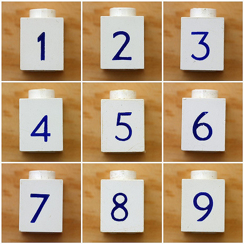

## Discussions : :question:Q01 :question:Q02

---

# Agenda
## Introduction : definition, issues
## Family 1 : academic social networks
## Family 2 : publishers' identifiers
## Family 3 : persistent identifiers
## Family 4 : open access repositories
## What opportunities for you?

---

#  Introduction : researcher profile?

Two main components are obvious.

## A web page
* Can you create a CV?
* Can you add free text?
* Can you add rich text (with images, hyperlinks, etc.)? 

## A publication list
* Are the metadata comprehensive and accurate?
* Is the list updated automatically or manually?
* How is access to full-text handled?

---

# Introduction : issues 1/2
## Identity
Make sure to be identified
* as yourself
* as a researcher

## Visibility / accessibility
Make sure to make visible / and accessible
* your publications
* your other outputs
* your other academic activities

---
# Introduction : issues 2/2

## Save time
:alarm_clock: Will you be willing to spend time updating different sites and services? Is it possible to find services with automatic updates? And services connectable to others to maximize automation?

## Impact / metrics
We will not discuss this topic today.

---

# Issues : identity

## Background
* more and more researchers
* a few names

## Names ambiguity
* Homonymy
* Different versions: full first name/initial(s)
* Transliteration
* Accents and other special characters
* Change of name
* Multiple names
:point_right: Names are not **machine readable**

---

# Issues : visibility / accessibility

## Background
* Dispersion of resources and access modes
* More and more research organizations are unsubscribing from subscription resources (or have never been able to subscribe due to costs)
* See part 1 about open access : provide access to users outside research organizations

---
# Introduction : researcher profile?

Here are the criteria of analysis and choice we are going to apply to the 4 families.

**1. Identification**
Does the tool identify you and how? Does it provide a reliable identification? 
**2. Web page**
Does the tool allow you to create a webpage? To what extent is it customizable?
**3. Publication list**
How does the tool perform regarding creating and updating your publication list?
**4. Full-text access**
Does the tool give access to your publications?
**5. Interoperability / openness**
Can you export your data? Can you connect your profile with other services, platforms, etc.?
**6. Compliance**
Does the tool allow you to be compliant with stakeholders' requirements?

---
# Before starting the game of 4 families, what families do you already use?

# :question:Q03

---

# Family 1 : academic social networks

---
# Family 1 : academic social networks : overview

Figures retrieved in April 2017 : 55 millions of accounts for [ResearchGate](https://www.researchgate.net), 13 millions for [Academia.edu](https://www.academia.edu/)

From : Bouchard, A. (2017). ‘Robin des bois ou rogue open access ? Les réseaux sociaux académiques en 2017’. UrfistInfo. Retrieved from https://urfistinfo.hypotheses.org/3107

## Examples of ResearchGate profiles
https://www.researchgate.net/profile/Laurent_Duval
https://www.researchgate.net/profile/Philippe_Gambette

---
# Family 1 : academic social networks : what for?

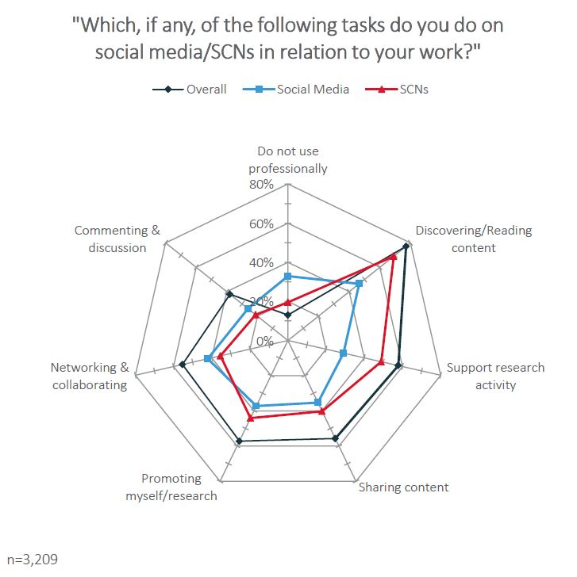
<!-- *footer : From : Staniland, M. (2017). ‘How do researchers use social media and scholarly collaboration networks (SCNs)?’ Of Schemes and Memes. Retrieved from http://blogs.nature.com/ofschemesandmemes/2017/06/15/how-do-researchers-use-social-media-and-scholarly-collaboration-networks-scns -->

---

# Family 1 : academic social networks : criteria 1/2

### 1. Identification
:warning::one: Very weak : no identifier provided and questionable accuracy of suggestions

### 2. Web page
Very limited customization

### 3. Publication list
Easy to create and update, but accuracy and quality of metadata are far from being guaranteed and customization is very limited

---
# Family 1 : academic social networks : criteria 2/2

### 4. Full-text access
:warning::two: Permissions might be different from the ones granted to deposit into an open access repository - see [Elsevier's sharing policy](https://www.elsevier.com/about/policies/sharing) and remember the wording of Law for a Digital Republic
:heavy_plus_sign: open access is not guaranteed

### 5. Interoperability / openness
You can put a lot of stuff into this kind of service, :warning::three: but what can you export?
### 6. Compliance
No way - see 4. - on the contrary, be aware of what content you upload if the servers' location is unknown 

---

# Family 1 : academic social networks : warnings
:warning::one: Weak identification resulting in unrelevant authorship suggestions

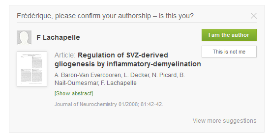

---
# Family 1 : academic social networks : warnings
:warning::three: Closed systems and economic concerns

> There is a big chance that as in the past commercial publishers have been selling our own _content_, our articles and books, back to us, or to our libraries, increasingly these kinds of platforms will be selling our own _data_ back to us or, more likely, to our universities, to feed into impact case studies and tenure portfolios. The data which is based on the relationships we have built up with others around ourselves and around our publications.

From :
Adema, J. (2017). ‘Academia.edu and Self-Branding : The Metricisation of Scholars and Scholarly Networks’. Open Reflections. Retrieved from https://openreflections.wordpress.com/2017/05/09/academia-edu-and-self-branding/

---
# Family 1 : academic social networks : concerns

Yet a positive and real use of ResearchGate and co?

> It was pointed out to me (on twitter) that ResearchGate can be important for scholars in China which has an authoritarian government that cuts off access to not just Facebook, but also Google**.

From : McGlynn, T. (2015). ‘I’m going to stop ignoring ResearchGate’. Small Pond Science. Retrieved from https://smallpondscience.com/2015/07/27/im-going-to-stop-ignoring-researchgate/

---

# Family 2 : publishers' identifiers

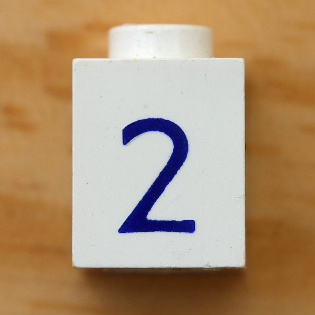

---

# Family 2 : overview

## Objectives for publishers 
* Ensure the reliability of their bibliographic database
* Address the issue of ambiguity of names

## Specific features 
* Integration with bibliographic databases 
* Bibliometric indicators - limited to articles indexed in the database of reference

:point_right: **ResearcherID** : created in 2008 - Clarivate Analytics = Web of Science
:point_right: **Scopus Author ID** : created in 2006 - Elsevier = Scopus

---

# Family 2 : overview

|ResearcherID|Scopus AuthorID|
|:--| :--|
|created by the user|automatically and systematically created by Elsevier|
|independant from a subscription to Web of Science for basic features| cannot be changed or edited without subscription to Scopus|
|possible to add publications from other sources | limited to publications indexed in Scopus : cannot attach publications from other sources |
|online user profile | no online user profile|

More about ResearcherID and Scopus Author ID : 
Research Services Librarians. ‘Research Identity’. University of Tasmania. Retrieved from http://utas.libguides.com/ManageID

---

# Family 2 : ResearcherID

Examples
http://www.researcherid.com/rid/B-5784-2014
http://www.researcherid.com/rid/E-7800-2010
http://www.researcherid.com/rid/A-7576-2008

---

# Family 2 : ResearcherID : criteria 1/2

### 1. Identification
Strong : identifier
:heavy_plus_sign: Detailed and structured description of affiliations
### 2. Web page
Very limited customization 
### 3. Publication list
Easy to create and update with accurate metadata, but very limited customization

--- 
# Family 2 : ResearcherID : criteria 2/2
### 4. Full-text access
Not handled
### 5. Interoperability / openness
Integrated with ORCID
:warning: You grant great permissions to Clarivate (see below)
### 6. Compliance
Some research institutions use ResearcherID to establish and assess researchers' publication lists. 

---

# Family 2 : ResearcherID : end user license agreement

From https://www.researcherid.com/resources/html/Policy.html

> 1.4.1. by using the ResearcherID Service and Your ResearcherID You will be providing ResearcherID Data to the Researcher Registry and You grant a royalty-free, perpetual, irrevocable license to:
> (a) Clarivate, its affiliates and applicable authorised third parties to use the ResearcherID Data in the course of providing or using the ResearcherID Service, Sponsored Services and the ResearcherID Website; and
> (b) Clarivate to reformat, extract, adapt or translate any ResearcherID Data;
>...
> 3.2. You agree and undertake that the information You provide during the registration process or which You subsequently update shall be accurate and up to date. You agree to regularly check Your profile in the Researcher Registry to ensure that it is accurate and up to date. 
---

# Family 3 : persistent identifiers

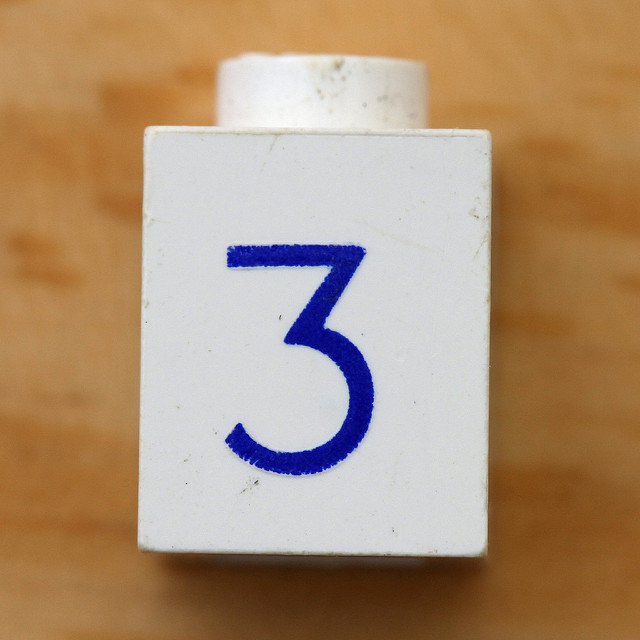

---

# Family 3 : ORCID iDs : overview 

* Launched in October 2012
* Managed by an independent non-profit organization
* Financed by members' subscriptions : members are publishers, research organizations, funding agencies, etc. - see [full list here](https://orcid.org/members)
* more than 5.8 million ORCID iDs registered in January 2019

## Objectives 
* Allowing computer use = **machine readability**
* Disambiguating and reinforcing uniqueness
* Allowing data to be linked and integrated

## Examples
http://orcid.org/0000-0001-7062-0262
https://orcid.org/0000-0003-4925-2009

---

# Family 3 : ORCID iDs : how does it work?

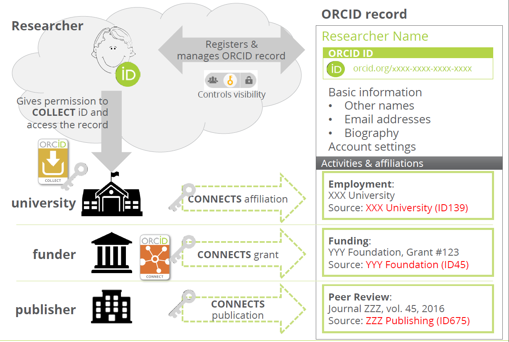

<!-- *footer : Image from : Paglione, L. et al. (2017). ‘Enter Once | Reuse Often: What does this mean to research institutions?’ https://doi.org/10.23640/07243.5544460.v1 -->

---

# Family 3 : ORCID iDs : want to know more ?

ORCID. (2018). All about ORCID [join the dots]. https://doi.org/10.23640/07243.5809464.v1

## Authenticate with ORCID

:zap: online demo : sign in HAL with institutional credentials through ORCID

## Getting started with ORCID
Follow the steps :

Cuesta, S. M. (2017). ‘Introduction to ORCID’. Cambridge. Retrieved from https://github.com/semacu/20180223_ORCID_Chemistry_Cambridge/blob/master/README.md#introduction-to-orcid

---

# Family 3 : ORCID iDs : criteria 1/2

### 1. Identification
Very strong : persistent identifier
:heavy_plus_sign: Detailed description of affiliations
:heavy_plus_sign: Affiliation possibly asserted by organization
### 2. Web page
Limited customization
### 3. Publication list
Easy to create and update with accurate metadata, very limited customization - may be **automatically updated**
:heavy_plus_sign: Comprehensive typology of publications and outputs

---

# Family 3 : ORCID iDs : criteria 2/2

### 4. Full-text access
Not handled
### 5. Interoperability / openness
Integrated with many other services and identifiers
:heavy_plus_sign: Very detailed and configurable privacy settings
### 6. Compliance
More and more publishers and funders require your ORCID iD at submission

---

# Family 4 : open access repositories

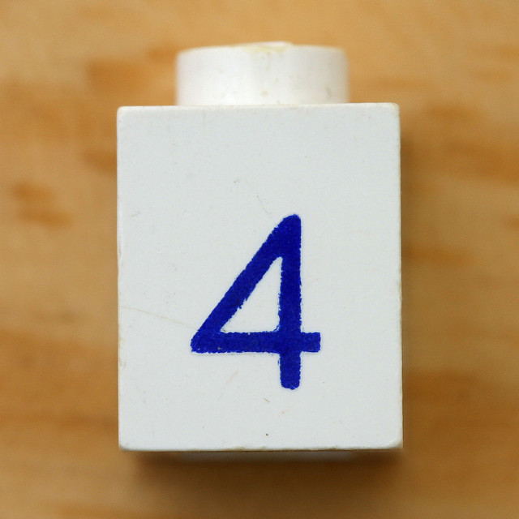

---

# Family 4 : open access repositories : Zenodo

:zap: We will focus on non-institutional repositories.

Example : https://zenodo.org/communities/dpodrepository/

With full explanation, comparison with academic social networks and with institutional repositories : 

O’Donnell, D. P. (2018). ‘Daniel Paul O’Donnell: Using Zenodo as a personal repository’. Daniel Paul O’Donnell Blog. Retrieved from http://people.uleth.ca/~daniel.odonnell/Blog/using-zenodo-as-a-personal-repository

---
# Family 4 : open access repositories : HAL

HAL offers a great tool to create your researcher profile, as it provides :
* an identifier = IdHAL,
* a webpage = CVHAL.

Examples : 
https://cv.archives-ouvertes.fr/richard-chbeir
https://cv.archives-ouvertes.fr/philippe-gambette
https://cv.archives-ouvertes.fr/laurent-duval

---

# Family 4 : HAL : how does it work? 1/3

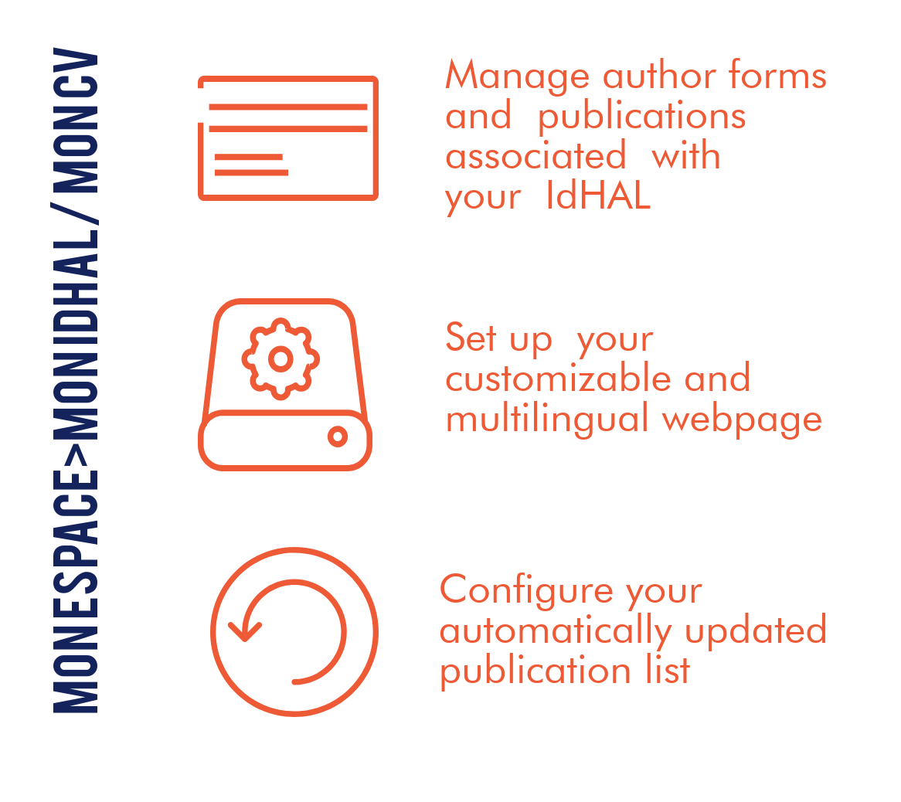

---

# Family 4 : IdHAL : how does it work? 2/3

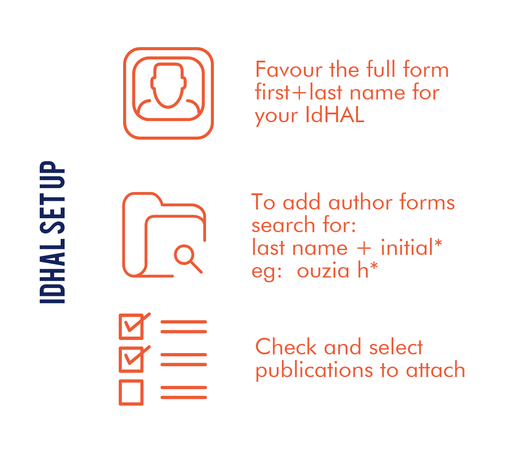

---

# Family 4 : HAL : how does it work? 3/3

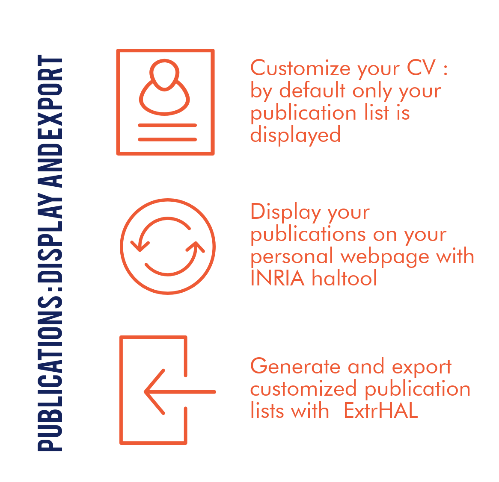

Full infographics with links, in French, available [here](https://create.piktochart.com/output/16208286-hal-gestion-des-auteurs)

---

# Family 3 : HAL : criteria 1/2

### 1. Identification
Strong : identifier 
:heavy_plus_sign: Affiliations connected to a controlled list of research units and organizations
### 2. Web page
Highly customizable, from creating rich text with a simple editor to uploading a customized CSS sheet
### 3. Publication list
Easy to create and update with accurate metadata, customizable - **automatically updated** by deposits in HAL
:heavy_plus_sign: Broad typology of publications and outputs

---
# Family 3 : HAL : criteria 2/2
### 4. Full-text access
Full and persistent open access provided
### 5. Interoperability / openness
Integrated with many other services 
:heavy_plus_sign: Indirect integration with ORCID, eg you can update your ORCID iD with data from HAL through BASE, as HAL is harvested by BASE
### 6. Compliance
HAL is compliant with open access requirements, such as the European Commission's ones.

---

# What opportunities for you?

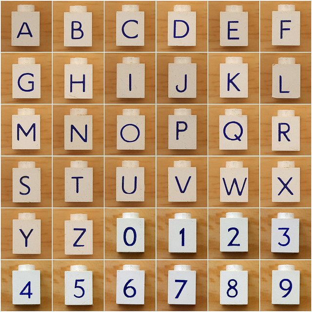

## :question: Q04

---
# What opportunities for you?
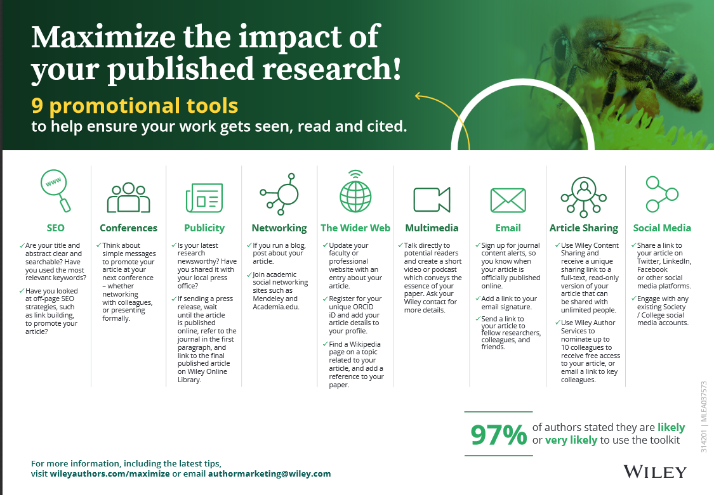

<!-- *footer : Image from : Wiley. ‘Promotional Toolkit for Authors’. Wiley Author Services. Retrieved from https://authorservices.wiley.com/author-resources/Journal-Authors/Promotion/promotional-toolkit.html -->

---
# What opportunities for you? Advice and strategies

## A 3 level strategy

>1. Get started: Bronze
>2. Build content: Silver
>3. Enhance your profile: Gold

Queensland University of Technology Library. ‘Create your researcher profile’. Library guides QUT. Retrieved from https://libguides.library.qut.edu.au/researcher_profile

## A detailed overview
Including examples, a 10 point checklist and a to-do list

Bouchard, A. (2018). ‘Construire son identité numérique de chercheur [formation doctorale]’. Retrieved from http://urfist.chartes.psl.eu/sites/default/files/ab/bouchard_identitenumerique_synthese_052018.pdf

---

# Thank you for your attention!

## Des :interrobang:
## Des :bulb:

 

:email: frederique.flamerie-de-lachapelle@u-bordeaux.fr
:telephone_receiver: 05.40.00.89.91

 

 [orcid.org/0000-0001-6014-0134](https://orcid.org/0000-0001-6014-0134)

<!-- *footer : Letter and number images by Reynolds, Leo. Retrieved from https://www.flickr.com/photos/lwr/sets/72157602636568000/ - CC-BY-SA
-->